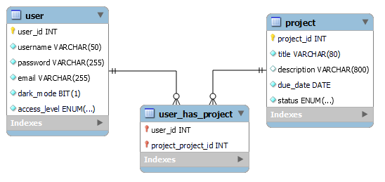

# Project Manager

Informatika 2 - VIAUAB01 - házi feladat

Név: Varga Csaba
Neptun-kód: K04JA8  
A bemutató videó URL-je: <https://www.youtube.com/watch?v=CAkkHLS_JkU>

## Specifikáció

___

### Feladat informális leírása

A ***Project Manager*** egy webalapú alkalmazás, amely lehetővé teszi az egyének vagy csapatok számára, hogy szervezett módon kezeljék feladataikat, projektjeiket és ezek határidejét. A rendszer felületet biztosít a feladatok létrehozásához és kiosztásához, a határidők meghatározásához. A felhasználók vizualizálhatják az előrehaladásukat, hogy munkájukkal naprakészek maradjanak.

### Elérhető funkciók

Az alkalmazás a következő funkciókat biztosítja:

- Alap funkciók a menüből:
  - Bejelentkezés: Bejelentkezési oldal és link a regisztrációs oldalra
  - Kezdőlap: Néhány információt jelenít meg az alkalmazásról
  - Projektek kezelése:
    - Projektvezető esetében:
      - Látja az alkamazottainak az előrehaladását
      - Feladatokat tud kiosztani
      - Határidőket tudja módosítani
    - Alkalmazott esetében:
      - Látja a számára kioszott feladatokat
      - Látja a feladatainak a határidejét
      - Le tudja adni az elkészített feladatokat
- Admin jogosultság esetén elérhető egy Adatbázis oldal, ahol az összes adatbázisban lévő adatot lehet megjeleníteni, módosítani és újakat beírni.

### Adatbázis séma

Az adatbázisban a következő entitásokat és attribútumokat tároljuk:

- **user**: user_id, username, password, email, dark_mode, access_level
  - dark_mode: A kiválasztott CSS felhasználónkénti tárolását segíti elő
  - access_level: jogosultsági köröket tartalmazza: *admin*, *project_lead*, *employee* és *guest*
- **project**: project_id, title, description, due_date, status
  - status: Az adott project állapotát tárolja: *not_started*, *in_progress* és *finished*

Ezeket a táblákat a **user_has_project** kapcsolótábla kapcsolja össze.

A fenti adatok tárolását az alábbi séma szemlélteti:

## Megvalósított pontot érő részletek

___

- Az adatbázisban összetett kulcs használata: 5p
  - A `user_has_project` kapcsolótáblának az oszlopai összetett kulcsot alkotnak (`user_id` , `project_id`)
- Az adatbázisban NOT NULL constraint használata (indokolható helyen): 3p
  - `user` tábla
    - `user_id` NOT NULL, mert elsődleges kulcs
    - `username` , `password` , `email` NOT NULL, mert a regisztrációhoz szükségesek
    - `dark_mode` és `access_level` NOT NULL, mert valamilyen értékkel mindenképpen rendelkezniük kell. Ezeknek van defualt értékük, rendre `1` és `guest` .
  - `project` tábla
    - `project_id` NOT NULL, mert elsődleges kulcs
    - `status` NOT NULL, mert valamilyen értékkel mindenképpen rendelkeznie kell. Van default értéke, `not_started`
  - `task` tábla
    - `task_id` NOT NULL, mert elsődleges kulcs
    - `project_project_id` NOT NULL, mert külső kulcs és nem létezhet az adott task projekt nélkül
- Az adatbázisban auto_increment használata: 2p
  - `user` tábla `user_id` oszlopa
  - `project` tábla `project_id` oszlopa
  - `task` tábla `task_id` oszlopa
- CSS váltás (skin cserélése) az alkalmazásból: 10p
  - `profile.php` oldalon lehet választani sötét és világos mód között.
- Kiválasztott CSS (vagy egyéb, megjelenésre vonatkozó beállítás) felhasználónkénti tárolása: 5p
  - a `user` tábla `dark_mode` oszlopa tárolja
    - 1 - sötét mód
    - 0 - világos mód
- Legalább két, nem triviális reguláris kifejezés használata: 5p
  - A felhasználónevek és a jelszavak bevitelénél használok 1-1 nem triviális reguláris kifejezés.
    - felhasználónév: Csak betűket, számokat és ._ karaktereket tartalmazhat. A speciális karakterek nem követhetik egymást illetve nem lehetnek a név elején vagy végén. Hossza minimum 4, maximum 50 karakter.
    - jelszó: Kell tartalmaznia legalább 1 számot (0-9), legalább 1 nagybetűt, legalább 1 kisbetűt és legalább 6 karakter hosszú kell legyen.
- Felhasználó kezelés jelszóval (nem plain textben tárolva): 10p
  - a jelszavakat `password_hash` függvénnyel hash-elem, `PASSWORD_DEFAULT` paraméterrel
- Kettőnél több jogosultsági kör támogatása: 5p
  - `user` tábla `access_level` oszlopa.
    - `guest`
    - `employee`
    - `project_lead`
    - `admin`
- Esztétikus megjelenés: max. 10p

## Dokumentáció

___

### Fájlok

#### connection.php

Adatbázishoz való kapcsolódást támogató függvények

- `connectDB()` : Csatlakozik az adatbázishoz, visszatér a kapcsolattal
- `closeDB($link)` : Megszakítja a paraméterként kapott kapcsotatot az adatbázissal

#### footer.php

Egységes lábléc

#### index.php

Ez a főoldal, ahol megjelennek a linkek az egyes aloldalakra.

#### login.php

Bejelentkezési `form`-ot megjelenítő oldal. Sikeres bejelentkezés esetén a `$_SESSION` változókat beállítja. Az `index.php` oldalra tér vissza.

#### logout.php

Törli a `$_SESSION` változókat, kijelentkezteti a felhasználót

#### menu.php

Minden oldalon meghívódik. Tartalmazza az egységes menüt, ami `5.3.0` -ás verziójú `Bootstrap navbar` -t használ. `Fontawesome` script is itt van meghívva.

#### profile.php

`employee` jogosultságú felhasználó esetén kiírja az elvégzett projektet és feladatok számát. Tartalmaz egy felhasználónév megváltozatására szolgáló `form` -ot. Tartalmaz egy jelszóváltoztatáshoz szükséges `form` -ot. Az oldal alján található egy `felhasználó törlése` gomb.

#### projects_admin.php

Táblázatban kilistázza az összes projektet és a hozzájuk tartozó felhasználókat. A projektekhez hozzá lehet rendelni a felhasználókat. Módosítani és törölni is lehet a projekteket a `projects_edit_admin.php` -ra és a `projects_delete.php`-ra mutató linkekkel.

#### projects_delete.php

`GET paraméterként` kap `project` IDt. Az adott projektet kitörli.

#### projects_edit_admin.php

`GET paraméterként` kap `project` IDt, `status` -t, `has_leader` és `leader_id` változókat. Kiír egy `form` -ot a projekt adatainak a módosításához. Egy projekt akkor lehet `in_progress` , ha `project_lead` és `employee` is hozzá van rendelve és nem lehet, hogy csak `employee` van hozzárendelve egy projekthez, kivéve ha a projekt státusa `finished` . A `projects.php` oldalra tér vissza.

#### projects_edit.php

`GET paraméterként` kap `project` IDt és `status` -t. Kiír egy `form` -ot a projekt adatainak a módosításához. Egy projekt akkor lehet `in_progress` , ha `project_lead` és `employee` is hozzá van rendelve és nem lehet, hogy csak `employee` van hozzárendelve egy projekthez, kivéve ha a projekt státusa `finished` . A `projects.php` oldalra tér vissza.

#### projects_employee.php

Megjeleníti az `employee` jogosultságú felhasználóhoz rendelt projekteket, azokat le tudja adni a `Lead` gomb segítségével ami továbbít a `projects_helper.php` oldalra.

#### projects_helper.php

`GET paraméterként` kap `action` változót és `project` IDt. Ha a `action == 'finished'` akkor a megfelelő projekt státuszát `finished` -re állítja. A `projects.php` oldalra tér vissza.

#### projects_lead.php

Megjelenít egy `form` -ot, ahol új projektet lehet létrehozni. Kiírja táblázatban a `not_started` státuszú projekteket. Ezeket `Kiosztás` gomb segítségével hozzá lehet rendelni alkalmazottakhoz. A `Kiosztás` gomb a `projects_helper.php` oldalra továbbít. Kiírja továbbá az `in_progress` és a `finished` projekteket. A `finished` projekteket leszámítva lehet módosítani az összes projektet. A projektek mellett van a `Feladatok` gomb, ami a `projects_task.php` oldalra továbbít.

#### projects_task_delete.php

`GET paraméterként` kap `task` és `project` ID-ket. Kitörli a megfelelő a `task` -ot. A `projects_task.php` oldalra tér vissza, visszaadja `GET paraméterként` a `project_id` -t.

#### projects_task_edit.php

`GET paraméterként` kap `task` és `project` ID-ket. A megadott `task` adatait lehet módosítani. A `projects_task.php` oldalra tér vissza, visszaadja `GET paraméterként` a `project_id` -t.

#### projects_task.php

Új `task` -ot lehet létrehozni, a meglévőket pedig mósodítani és törölni lehet

#### projects.php

Ha a hozzáférési szint:

- `employee` akkor a `projects_employee.php` -t tölti be
- `project_lead` akkor a `projects_lead.php` -t tölti be
- `admin` akkor a `projects_admin.php` -t tölti be

#### register.php

Regisztrációs `form` -ot megjelenítő oldal. Az `index.php` oldalra tér vissza.

#### users_delete.php

`GET paraméterként` megkapja annak a felhasználónak a `user-id` -jét, akit törölni szeretnénk. A felhasználóhoz kapcsolt projekteket `not_started` állapotba kell állítani. Ha projekt vezetőt törlünk. A `users.php` oldalra tér vissza.

#### users_edit.php

Megjelenít egy `form` -ot, ahol meglévő felhasználók adatait lehet módosítani (felhasználónév, email,ID, sötét mód, hozzáférési szint). Az egyes bemenetek `placeholer` szövegeként az aktuális adatokat jeleníti meg. Ha a jelenleg is bejelentkezve lévő felhasználó saját adatait módosítja, akkor a `$_SESSION` változókat is frissíteni kell. A `users.php` oldalra tér vissza.

#### users_insert.php

Új felhasználót lehet létrehozni egy `form` -on keresztül. A következő adatokat szükséges megadni: felhasználónév, email, ID, jelszó, sötét mód,hozzáférési szint. Az ID megadása nem kötelező az `AUTO_INCREMENT` miatt. A sötét módnak és a hozzáférési szintnek is van `default value` -ja, ezért ezek megadása sem kötelező.

#### users.php

Lehetőség van a `user` táblában keresni. Ezen felül kiír minden adatot a `user` táblából, illetve van egy link a `user_insert` oldalra.
